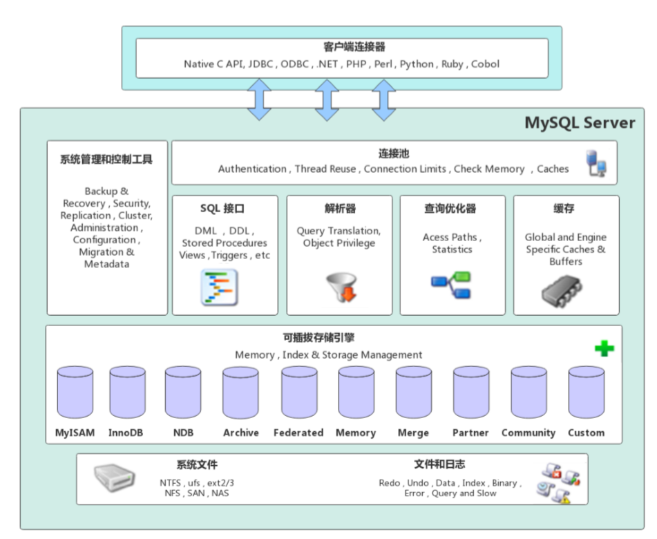

# MySql成长之路

### 1. 课程大纲
#### 1.学前准备
1. Mysql下载安装（MariaDB）
2. 熟悉MySQL工具（Navicat）和基本SQL操作
3. 熟悉主键、外键、飞空、唯一等约束
4. 熟悉索引、事务的概念和基本使用

#### 2.主要内容
1. MySql架构原理和存储机制
   ```
   MySQL体系结构（内存结构、磁盘结构）、SQL运行机制、存储引擎、Undo/Redo Log等
   ```
   
2. MySql索引存储机制和工作原理
   ```
   索引存储结构、索引查询原理、索引分析和优化、查询优化等
   ```

3. MySql事务和锁工作原理
   ```
   事务隔离级别、事务并发处理、锁机制和实战等
   ```

4. MySql集群架构及相关原理
   ```
   集群架构设计理念、主从架构、双主架构、分库分表等
   ```

5. 互联网海量数据处理实战
   ```
   ShardingSphere、MyCat中间件实战操作，分库分表实战
   ```

6. MySql第三方工具实战
   ```
   同步工具、运维工具、监控工具等
   ```

#### 3.MySQL应用架构变
1. 架构1.0 - 单机单库
   + 优点：
      1. 一个简单的小型网站或者应用背后的架构可以非常简单
   + 瓶颈：
      1. 数据量太大，超出一台服务器承受的范围
      2. 读写操作量太大，超出一台服务器承受的范围
      3. 可用性太低，服务器挂了服务也就挂了
      
2. 架构2.0 - 主从架构
   + 优点：
      1. 主库宕机可以通过主从切换保障高可用
      2. 主库抗写压力，从库分担读压力，提高读取并发能力
   + 瓶颈：
      1. 数据量太大，超出一台服务器承受的范围 
      2. 当写操作量太大，超出一台服务器承受的范围
      
3. 架构3.0 - 分库分表

4. 架构4.0 - 云数据库

### 2. MySQL架构原理
#### 1. MySQL体系架构

MySQL架构自顶向下大致可以分为：网络连接层、服务层、存储引擎层和系统文件层

1. 网络连接层
   ```
   客户端连机器（Client Connectors）：指能够与MySQL服务器建立连接的客户端。例如：C、Java、Python等
   ```
   
2. 服务层
   ```
   服务层是MySQL Server的核心，主要包含系统管理和控制工具、连接池、SQL接口、解析器、查询优化器和缓存6个部分   
   ```
   1. 连接池：负责存储和管理客户端与数据库的连接，一个线程负责管理一个连接。
   2. 系统管理和控制工具：例如备份恢复、安全管理、集群管理等。
   3. SQL接口：用于接受客户端发送的各种SQL命令，并且返回用户需要查询的结果。比如：DML、DDL、存储过程、视图、触发器等。
   4. 解析器：负责将请求的SQL解析生成一个“解析树”。然后根据一些MySQL规则进一步检查解析树是否合法。
   5. 查询优化器：当“解析树”通过解析器语法检查后，将交由优化器将其转化成执行计划，然后与存储引擎交互。
   6. 缓存：缓存机制是由一系列小缓存组成的。比如：表缓存、记录缓存、权限缓存，引擎缓存等。
      如果查询缓存中有命中的查询结果，查询语句就可以直接去查询缓存中取数据。

3. 存储引擎层   
   ```
   存储引擎负责MySQL中数据的存储和提取，与底层文件系统交互。MySQL存储引擎是插件式的，
   服务器中的查询执行引擎通过接口与存储引擎进行通信，接口屏蔽了不同存储引擎之间的差异。
   现在有很多种存储引擎，各有各的优点，最常见的是MyISAM和InnoDB。
   ```

4. 系统文件层
   ```
   该层负责将数据库的数据和日志存在文件系统之上，并完成与存储引擎的交互，是文件的物理存储层。
   主要包含日志文件、数据文件、配置文件、pid文件、socket文件等。
   ```
   + 日志文件：
      + 错误日志：
        ```
        记录错误日志，默认开启
        SHOW VARIABLES LIKE '%log_error%'
        ```
        
      + 通用查询日志:
        ```
        记录一般查询日志
        SHOW VARIABLES LIKE '%general%' 
        ```
        
      + 二进制日志
        ```
        记录了对MySQL数据库执行的更改操作，并且记录了语句的发生时间、执行时长；
        但是它不记录select、show等不修改数据的库的SQL。
        主要用于：主从复制、数据库恢复
        -- 是否开启
        SHOW VARIABLES LIKE '%bin_log%';
        -- 参数查看
        SHOW VARIABLES LIKE '%binlog%';
        -- 查看日志文件
        SHOW BINARY LOGS; 
        ```
      
      + 慢查询日志
        ```
        记录所有执行时间超时的查询SQL，默认10秒。
        -- 是否开启
        SHOW VARIABLES LIKE '%slow_query%';
        -- 超时时长
        SHOW VARIABLES LIKE '%long_query_time%';   
        ``` 
   + 配置文件
     ```
     用于存放MySQL所有的配置信息文件，比如：my.cnf、my.ini等
     ```
     
   + 数据文件
     ```
     1. db.opt文件：记录这个库默认使用的字符集和校验规则
     2. frm文件：存储与表相关的元数据信息，包括表结构的定义信息等，每张表都有一个frm文件
     3. MYD文件：MyISAM存储引擎专用，存放MyISAM表的数据，每张MyISAM引擎表都有一个对应的.MYD文件
     4. MYI文件：MyISAM存储引擎专用，存放MyISAM表的索引相关信息，每张MyISAM引擎表都有一个对应的.MYI文件
     5. ibd文件和IBDATA：存放InnoDB的数据文件（包括索引）。InnoDB存储引擎有两种表空间方式：独享表空间和共享表空间。
        独享表空间使用.ibd来存放数据，每张InnoDB引擎表都有一个对应的.ibd文件。
        共享表空间使用.IBDATA来存放数据，所有InnoDB引擎表共同使用一个（或多个、自行配置）.IBDATA文件
     6. ibdata1文件：系统表空间数据文件，存储表元数据、Undo日志等。
     7. ib_logfile0、ib_logfile1文件：Redo日志文件
     8. pid文件：pid文件是mysqld应用程序在Unix/Linux环境下的一个进程文件，和许多其他的Unix/Linux服务端程序一样，它存放着自己的进程id。
     9. socket文件：socket文件是在Unix/Linux环境下才有的，用户在Unix/Linux环境下客户端连接可以不通过TCP/IP网络而直接使用Unix Socket来连接MySQL。    
     ```
   
#### 3.MySQL日志系统原理
#### 3.5.1 Undo Log介绍
```
Undo：意为撤销或取消，以撤销操作为目的，返回指定某个状态的操作。

Undo Log：数据库事务开始之前，会将要修改的记录存放到Undo日志里，当事务回滚时或者数据库奔溃时，可以利用Undo日志，撤销未提交的事务对数据库产生的影响

Undo Log产生和销毁：Undo Log在事务开始前产生；事务在提交时，并不会立刻删除Undo log，InnoDB会将该事务对应的Undo Log放入到删除列表中，
    后台会通过后台线程purge thread进行回收处理。Undo Log属于逻辑日志，记录一个变化过程。

Undo Log存储：Undo Log采用段的方式管理和记录。在InnoDB数据文件中包含一种Rollback segment回滚段，内部包含1024个Undo Log segment。
    SHOW VARIABLES LIKE '%innodb_undo%'
```
#### 3.5.2 Undo Log作用
```
1. 实现事务的原子性
2. 实现多版本并发控制（MVCC）
```

#### 3.6 Redo Log和Binlog
1. Redo Log日志
   1. Redo Log介绍
      ```
      Redo：顾名思义就是重做。以恢复操作为目的，在数据库发生意外时重现操作。
      
      Redo Log：指事务中修改的任何数据，将最新的数据备份存储的位置（Redo Log），被称为重做日志。
      
      Redo Log的生成和释放：随着事务操作的执行，就会生成Redo Log，在事务提交时会将产生的Redo Log写入到Log Buffer，
          并不是随着事务的提交就立刻写入磁盘文件。等事务操作的脏页写入到磁盘之后，Redo Log占用的空间就可以重用了（被覆盖写入）
      ```
  
   2. BinLog
    
### 第二部分 MySQL索引原理 
#### 第一节 索引类型
索引可以提升查询速度，会影响where查询，以及order by排序。MySQL索引类型如下：
+ 索引存储结构划分：B Tree索引、Hash索引、FULLTEXT全文索引、R Tree索引
+ 应用层次划分：普通索引、唯一索引、主键索引、复合索引
+ 索引键值类型划分：主键索引、辅助索引（二级索引）
+ 数据存储和索引键值逻辑关系划分：聚集索引（聚簇索引）、非聚集索引（非聚簇索引）
   
#### 1.1 普通索引
最基本的索引类型，基于普通字段建立的索引，没有任何限制。创建方式如下：
1. CREATE INDEX index_name ON table_name(column_name)
2. ALTER TABLE table_name ADD INDEX index_name(column)
3. CREATE TABLE table_name([...],INDEX index_name(column_name))

#### 1.2 唯一索引
与普通索引类似，不同的就是：索引字段的值必须唯一，但允许为空值。创建方式如下：
1. CREATE UNIQUE INDEX index_name ON table_name(column_name)
2. ALTER TABLE table_name ADD UNIQUE INDEX index_name(column)
3. CREATE TABLE table_name([...],UNIQUE index_name(column_name))

#### 1.3 主键索引
主键索引是一种特殊的唯一索引，不允许有空值，每个表的主键只能有一个。创建方式如下：
1. ALTER TABLE table_name ADD PRIMARY KEY index_name(column)
2. CREATE TABLE table_name([...],PRIMARY KEY index_name(column_name))
   
#### 1.4 复合索引
在多个列上创建的索引，就是复合索引。复合索引在数据库操作期间所需要的开销更小，
可以代替多个单一索引。

索引同时有两个概念叫做窄索引和宽索引，窄索引是指列为1-2列的索引，宽索引是指2列以上的索引
索引设计的重要原则是：能用窄索引就不用宽索引
   
#### 1.5 全文索引
1. CREATE FULLTEXT INDEX index_name ON table_name(column)
2. ALTER TABLE table_name ADD FULLTEXT INDEX index_name(column)
3. CREATE TABLE table_name([...],FULLTEXT KEY index_name(column)

+ 全文索引必须在字符串、文本字段上建立。
+ 全文索引字段值必须在最小字符和最大字符之间才会有效。（INNODB：3~84，MyISAM：4~84）
+ 全文索引字段值要进行切词处理，按照syntax字符进行切割。
+ 全文索引匹配查询，默认使用的是等值匹配。例如：a只会匹配a，不会匹配ab；如果想匹配可以在bool模式下搜索a*

#### 第二节 索引类型
索引的定义：索引是存储引擎用于快速查找记录的一种数据结构。需要额外开辟空间和数据维护工作。
+ 索引是物理数据页存储，在数据文件中（InnoDB，.idb文件），利用数据页（page）存储。
+ 索引可以加快检索速度，但是同时也会降低增删改操作速度，索引维护需要代价

索引设计的理论知识：二分查找法、Hash和B+Tree。
#### 2.1 二分查找法
#### 2.2 Hash索引
#### 2.3 B+Tree结构
Mysql数据库索引采用的是B+Tree结构，在B-Tree结构上做了优化改造。

+ B-Tree结构：
    + 索引值和data数据分布在整棵树结构中
    + 每个节点可以存放多个索引值及对应的data数据
    + 树节点中的多个索引值从左到右升序排列
    
B-Tree的搜索：
```
从根节点开始，对节点内的索引值序列采用二分法查找，如果命中就结束查找。
没有命中会进入子节点重复查找过程，直到所对应的节点指针为空，或已经是叶子节点了才结束
```

+ B+Tree结构：
    + 非叶子节点只存储索引值，不存储data数据，这样便于存储更多的索引值
    + 叶子节点包含了所有的索引值和data数据
    + 叶子节点之间用指针连接，提高区间的访问性能

B+Tree的搜索：
```
相比B树，B+树进行范围查找时，只需要查找定位两个节点的索引值，然后利用叶子节点的指针进行遍历即可。
```

#### 2.4 聚簇索引和辅助索引
+ 聚簇索引：
   ```
   聚簇索引是一种数据存储方式，InnoDB的聚簇索引就是按照主键顺序构建B+Tree结构。
   B+Tree的叶子节点就是行记录，行记录和主键值紧凑地存储在一起，这也意味着InnoDB的主键索引就是数据表本身，
   它按主键顺序存放了整张表的数据，占用的空间就是整个表数据量的大小。通常说主键索引就是聚簇索引
   ```

+ 辅助索引：
   ```
   InnoDB辅助索引，也叫作二级索引，是根据索引列结构B+Tree结构。但在B+Tree的叶子结点中只存了索引列
   和主键的信息。二级索引占用的空间会比聚簇索引小很多，通常创建辅助索引就是为了提升查询效率。
   一个表InnoDB只能创建一个聚簇索引，但可以创建多个辅助索引。 
   ```

InnoDB的表要求必须有聚簇索引：
1. 如果表定义了主键，则主键索引就是聚簇索引
2. 如果表没有定义主键，则第一个非空unique列作为聚簇索引
3. 否则InnoDB会创建一个隐藏的row-id作为聚簇索引 
   
聚簇索引和非聚簇索引：B+Tree叶子节点存放主键索引和行记录就是聚簇索引；如果索引值和行记录分开存放就属于非聚簇索引。
主键索引和辅助索引：B+Tree的叶子节点存放的是主键字段值就属于主键索引；如果存放的是非主键值就属于辅助索引（二级索引）。

#### 第三节 索引分析与优化   
#### 3.1 EXPLAIN   
```
EXPLAIN 可以对SELECT语句进行分析，并输出SELECT执行的详细信息，供开发人员针对性的优化。
```
+ select_type: 表示查询的类型。
  + SIMPLE：表示查询语句不包含子查询、UNION等操作
  + PRIMARY：表示查询是最外层的
  + UNION：表示查询是UNION联合的
  + DEPENDENT UNION：表示UNION查询中使用到了外面的查询结果
  + UNION RESULT：UNION的结果
  + SUBQUERY：子查询
  + DEPENDENT SUBQUERY：表示子查询使用到了外面的查询结果
 
+ type：表示存储引擎查询数据时采用的方式。比较重要的一个属性，通过它可以判断是否为全表扫描。
  常用属性从上到下依次增强
  + ALL：表示全表扫描，性能最差 
  + index：表示基于索引的全表扫描，先扫描索引再扫描全表数据。排序场景性能比ALL高
  + range：表示使用索引范围查询。
  + ref：表示使用非唯一索引进行单值查询。
  + eq_ref：一般情况下出现在多表join查询中。表示前面表的每一行记录，都只能匹配后面表的一行结果。
  + const：表示使用主键或唯一索引做等值查询，也称作：常量查询。
  + NULL：表示不用访问表，速度最快。
    
+ possible_keys：表示查询时能够使用到的索引，并不一定会真正使用，显示的是索引名称。
+ key: 表示查询时真正使用的索引，显示的是索引名称。
+ row：查询优化器根据统计信息，估算SQL要查询到结果扫描多少数据。rows越小越好
+ key_len：表示查询使用了索引的字节数量。可以判断是否使用了组合索引或只用到了索引的最左部分的部分字段。
   ```
   key_len的计算规则如下：
      字符串类型：
         1. 字符串长度跟字符集有关：latin1=1、gbk=2、utf8=3、utfmb4=4
         2. char(n)：n * 字符集长度
         3. varchar(n)：n * 字符集长度 + 2字节
   
      数值类型：
         1. TINYINT：1个字节
         2. SAMLLINT：2个字节
         3. MEDIUMIT：3个字节
         4. INT、FLOAT：4个字节
         5. BIGINT、DOUBLE：8个字节
  
     时间类型：
         1. DATE：3个字节
         2. TIMESTAMP：4个字节
         3. DATETIME：8个字节
   
     字段属性：  
         NULL属性占用1个字节，如果一个字段设置了NOT NULL，则没有此项
   ```
+ Extra：表示很多额外的信息，各种操作会在Extra提示相关信息，常见几种如下：
   + Using where：表示查询需要通过索引回表查询数据。
   + Using index：表示查询通过索引就可以满足所需数据。
   + Using filesort：表示查询出来的结果需要额外的排序。数据量小在内存中做，数据量大在磁盘做，因此有Using filesort建议优化
   + Using temprorary：表示查询使用到了临时表，一般出现于去重、分组操作，建议优化
    
#### 3.2 回表查询  
先通过辅助索引定位主键值，然后再通过聚簇索引定位行记录，这就是回表查询

#### 3.3 覆盖索引
只要在一颗索引树上就能获取SQL所需的所有列数据，无需回表，速度更快，这就是索引覆盖   

#### 3.4 最左前缀原则
复合索引使用时遵循最左前缀原则，即查询中使用到最左边的列，那么查询就会使用索引，
如果从索引的第二列开始查找，那么索引将失效。

#### 3.5 LIKE查询
在使用like查询时，索引可以被使用，但是字符串前面不得有%

#### 3.6 NULL查询
可以使用索引但是不建议使用，通常列设置为NOT NULL   
   
   
   